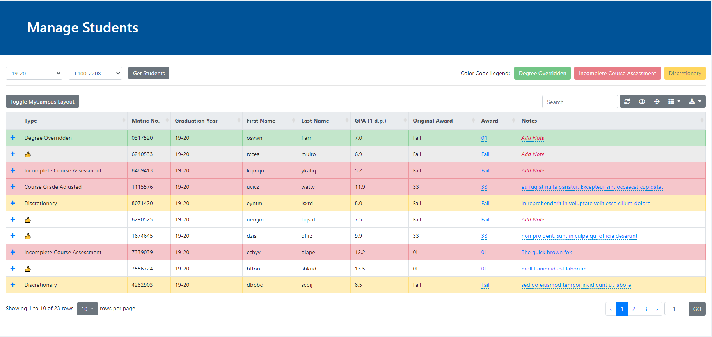
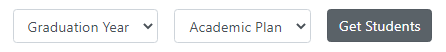
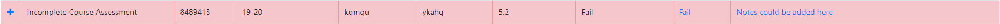
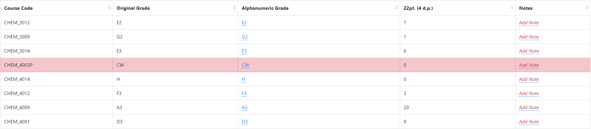
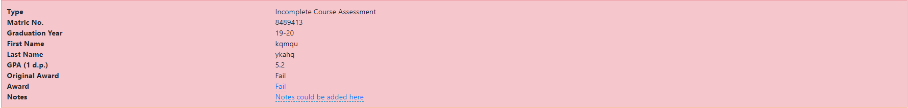
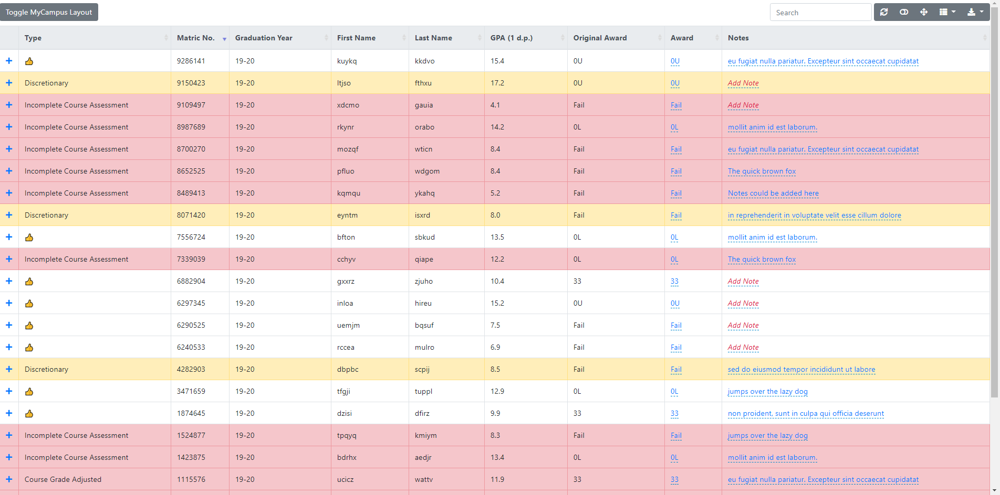
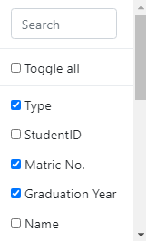
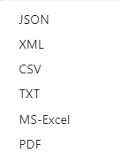

# Usage Guide

Please read this guide **thoroughly** for the application to work as intended. If you have any questions regarding the usage of the application, please [contact us](README.md#authors-and-contact).

##### Table of Contents
[General Features](#general-features)  
[User Hierarchy](#user-hierarchy)  
[Upload](#upload)  
[Course Grades](#course-grades)  
[Manage and Export CSV](#manage-and-export-csv)  

## General Features

### Search

The search bar allows users to search for a student by first name, last name, matriculation number, academic plan or graduation year. The search results will show the student in card form and will directly link to the [course grade](#course-grades) page or the [manage](#manage-and-export-csv) page with the appropriate filters for the student in the case of the latter (academic plan and graduation year with matriculation number in the table search)

### Sidebar
The sidebar allows users to quickly navigate between pages. The menu icon [&#8801;] expands the sidebar to view the page names for each icon. When expanded the icon will change to the cross icon [&#x2715;] which collapses the sidebar for more
space to work with.

### Footer Links
Quick links in the footer lets the user navigate between pages. It is functionally similar to the sidebar. When it is used by a user without the admin or staff status, a mailto link allows the user to contact the system administrator for elevated permissions.

### Password Reset
The password reset link is available at the login screen. Simply click on the Forgot Password link and enter a valid email. A mail will be sent to the registered email with a link to reset the password.

### Logo
The logo is specially created for the School of Chemistry database. Clicking on it leads the user back to the home page.

## User Hierarchy

### Admin
As part of the setup process, an admin (superuser) account should have been created. An admin user is able to manage all other users (by adding or removing permissions for each of the hierarchy groups) in addition to data stored in the database.

### Staff
By default, a staff is able to access the admin page albeit not being able to access anything else. An admin should assign permissions to the user as required.

### User
A user in the User group is not able to edit anything on the webpage, upload grades and will not be able to access the admin site. They will still be able to view data and generate graphs.

## Upload

## Course Grades
This is where student's course grades are filtered and displayed, this page has viewing permission only, there is no editing from the user. 
Using the search bar that is located above "Alphanumeric Grade", allows the user to search for different information and will display only the data that matches the user's input, for example this could be a course code, studentId or a grade. 
Different academic years can also be filered using the "Year" drop down menu on the left hand of the screen.
The arrows next to the table column headers allow for users to display the requested data either in asending or desending order and the column icon to the far right of the screen above "22pt Grade" allows the user to toggle what data feilds are shown. 

## Manage and Export CSV

  

This is where student's grades are managed and exported. Student's award will be calculated before being displayed on the table.

### Load Table
  

The table could be loaded by selecting the required Academic Plan and Graduation Year. By clicking on "`Get Students`", the student's award will be calculated before being loaded to the table.

### Edit A Grade
  

Grades could be edited by clicking on the [&#43;] icon which expands a subtable with all the grades for the student.

You could select a grade from the **Alphanumeric Grade** section to edit (Editable fields are in blue). A dropdown list will show up with all the possible grades. After a grade has been selected, [&#10003;] to keep changes or [&#x2715;] to discard changes (as with all editable fields). Notes could be added if required.

### Edit An Award

  

Student's award could be edited by clicking on the award from the **Award** row. If the new award is not the same as the original award, the row will show up as green to signify that the award has been overridden. Notes could be added if required.

### The Table
The table comes with features such as row highlighting, note-taking,  sortability, searchablilty and keyboard shortcuts.
#### **Row Highlighting**

Rows are highlighted according to its corresponding issues. There is an order of priority as to which color the row will be highlighted should there be more than one issue. This is because we are not able to use all colors. The current order of importance is:

*Degree Overridden* &#8594; *Incomplete Course Assessment* &#8594; *Discretionary*

***Green***  
Degree Overridden  
> When a degree has been overridden (the new award is no longer the same as the original award), the row shows up as green. This will hide issues such as *Incomplete Course Assessments* or *Discretionary*.

Grades Overridden (Sub-table only)  
> When a grade has been overridden (the new grade is no longer the same as the original grade), the row shows up as green. This is only visible in the sub-table.

***Red***  
Incomplete Course Assessment  
> When a student is missing grades for their academic plan, or the grades are a special code (CW, CR or MV), the row shows up as red. This will hide issues such as grades being in the discretionary zone. The row highlighting will go away once all the issues have been fixed.

Course Grade Adjusted  
> When a student's grade has been overridden and there are still special codes, the row will show up as red. It will stay red if the student decides not to retake the course. This will hide *Discretionary* issues.

***Yellow***  
Discretionary  
> When a student's final gpa is in the discretionary range, the row will show up as yellow.

#### **Notes**

Notes could be added to both the grades and the award row to document changes and justification. The notes section is not searchable as with all editable fields. Simply click on the red *Add Notes* or an existing note to add a note or make changes.

#### **Sortability**

All columns are sortable. The first click sorts the column in ascending order, the second in descending order and the third to reset the sort.

#### **Searchability**

Almost all fields are searchable with the exception of editable fields.

#### **Export**
The data in the table could be exported in the following formats. The exported data will have the academic plan as the file name and will contain all the columns that are currently visible. To export in MyCampus friendly format, click on the Toggle MyCampus Layout to quickly toggle between edit-friendly and MyCampus layout.

***JSON***: Currently of no use but may be helpful in future projects to transfer data between databases (requested to be kept)  
***CSV***: The required format for MyCampus  
***TXT***: Exported in plain text separated by commas. The content is the same as *CSV*  
***MS-Excel***: Microsoft Excel format with the file extension of `.xls`. There will be a warning about file extension incompatibility which should not matter as the file format is `xlshtml` and the extension is `.xls`.  
***PDF***: Exports the table in pdf format. Notes that are too long will be truncated.

#### **Keyboard Shortcuts**

Keyboard shortcuts allow users to increase productivity by navigating the page smoothly. 

- ***Left* and *Right* arrow keys**: Move between pages
- **"`s`" key**: sets the caret (the "`|`" cursor in text boxes) to the search box for the table
- **"`r`" key**: refreshes the table manually (should it be opted over automatic refresh with every change)
- **"`t`" key**: toggles between the row view and the *Card View*

#### **Toolbar**
  

From left to right:  
- ***Searchbar***: Searches the table for the query entered with the exception of editable fields
- ***Refresh***: Manual refresh of the table should it be opted over automatic refresh with every change
- ***Card View***: Shows all the rows in *Card View*  

- ***Full Screen***: Shows the table exclusively in full screen  

- ***Toggle Columns***: Choose columns to show or to hide from the table. The search bar inside the dropdown allows users to quickly search for the desired column  

- ***Export***: Export the table in the desired format.  
